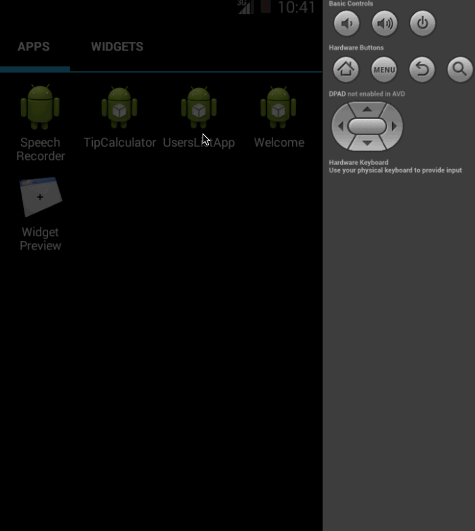

TipCalculator
=============

An app to calculate the tip for a check amount

Time spent: 1.5 hours spent in total

Completed user stories:

 * [x] User is displayed the tip of specified percentage for specified entered amount 
 * [x] User enters the total amount of the transaction
 * [x] User can select between tip amounts (i.e 10%, 15%, 20%)
 * [x] Upon selecting tip amount, formatted tip value is displayed
 * [x] Optional: User can select custom tip percentage if desired
 * [x] Optional: Toast for invalid check and tip percent notification 

Notes:

* Spent some time going over understanding of event listeners
* Went over the video/slides of the first app tutorial

Walkthrough of all user stories:

GIF created with [LiceCap](http://www.cockos.com/licecap/)
